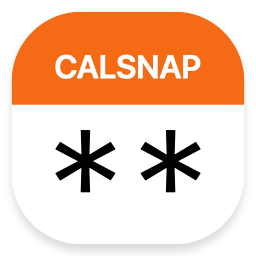

<div align="center">
  

  <h1>CalSnap<br /><small>Custom TeamSnap Calendars</small></h1>
</div>

CalSnap serves custom team calendar that are more detailed, clear, and usable. CalSnap deploys as a Cloudflare Worker (serverless function), connects to your TeamSnap account, and serves `.ics` iCalendar subscriptions for each team.

**“TeamSnap already has calendars! Why use this?”**

While TeamSnap supports calendar subscriptions, events lack useful information, team names are too long, and descriptions are messy.

CalSnap uses the TeamSnap API so that your calendars include:

- a custom team name (shorter or more descriptive)
- links to individual TeamSnap event pages
- arrival times (minutes early)
- event notes by team manager or coach

Try the [CalSnap settings demo](https://andesco.github.io/calsnap/) to see how you can customize your TeamSnap team calendars:

<div align="center">

## <a href="https://andesco.github.io/calsnap/">demo: CalSnap settings</a>

#### Calendar Event Titles:
<table>
  <tr>
      <td><b>CalSnap
      <td><b>TeamSnap
  <tr>
    <td>Leafs vs. Forest Hill Knights
    <td>North Toronto Leafs 2014 U12 AAA…
  <tr>
    <td>Leafs vs. East York Lynx
    <td>North Toronto Leafs 2014 U12 AAA…
  <tr>
    <td>Leafs: Game
    <td>North Toronto Leafs 2014 U12 AAA…
</table>

#### Calendar Event Details:

<table>
   <tr>
      <td><b>CalSnap
      <td><b>TeamSnap
   <tr>
      <td>
         Leafs vs. Forest Hill Knights<br />
         GitHub Arena<br />
         101 Command Line Ave.<br />
      <td>
         North Toronto Leafs 2014 U12 AAA…<br />
         101 Command Line Ave.<br />
         &nbsp;
   <tr>
      <td>
         Away at Forest Hill Knights<br />
         Uniform: White<br />
         GitHub Arena<br />
         Rink B<br />
         Arrival: 1:20 PM · 40 min.<br />
         Notes: limited parking<br />
         <a href="https://go.teamsnap.com/12345/schedule/view_event/67890">TeamSnap event page link</a>
      <td>
         Location: GitHub Arena - Rink B<br />
         Uniform: White (Arrival Time: 1:20<br />
         PM (Eastern Time (US & Canada)))<br />
         &nbsp;<br />
         &nbsp;<br />
         &nbsp;<br />
         &nbsp;<br />
</table>

</div>


## Setup

### step 1. Deploy Cloudflare Worker

#### option A: Cloudflare Dashboard

[](https://deploy.workers.cloudflare.com/?url=https://github.com/andesco/calsnap)

1. <nobr>Workers & Pages</nobr> ⇢ <nobr>Create an application</nobr> ⇢ <nobr>[Clone a repository](https://dash.cloudflare.com/?to=/:account/workers-and-pages/create/deploy-to-workers)</nobr>
2. Git repository URL:
    ```
    http://github.com/andesco/calsnap
    ```

#### option B: Wrangler CLI

1. Create a [Cloudflare Workers KV](https://developers.cloudflare.com/kv/) namespace with Wrangler CLI and note the new namespace ID:
    ```bash
    git clone https://github.com/andesco/calsnap.git
    cd calsnap
    wrangler kv namespace create "CALSNAP_CALENDAR_STORE"
    ```

2. Update `wrangler.toml` with the new KV namespace ID and set your environment variables:
    ```toml wrangler.toml
    [[kv_namespaces]]
    binding = "CALSNAP_CALENDAR_STORE"
    id = "{new KV namespace ID}"
    ```

3. Deploy with Wrangler CLI: \
   `wrangler deploy`

> [!Note]
> Note the URL of your new worker: \
  <nobr>`https://calsnap.{subdomain}.workers.dev`</nobr>


### step 2. Create TeamSnap Application

1. [TeamSnap authentication](https://auth.teamsnap.com/) ⇢ [Your Account](https://auth.teamsnap.com/) ⇢ [Your Applications](https://auth.teamsnap.com/oauth/applications) ⇢ [New Application](https://auth.teamsnap.com/oauth/applications/new)

2. Name: `TeamSnap Custom Calendar` \
   Description: `Cloudflare Worker` \
   Redirect URI: <nobr>`https://calsnap.{subdomain}.workers.dev`</nobr>

3. Client ID: `{your Client ID}` \
   Client Secret: `{your Client Secret}`
   
### step 3. Setup Cloudflare Worker

#### option a: Cloudflare Dashboard

1. [Workers & Pages](https://dash.cloudflare.com/?to=/:account/workers-and-pages/) ⇢ `{worker}` ⇢ Settings: <nobr>Variables and Secrets: Add:</nobr>
2.  Type: `Text`\
    Variable name: `TEAMSNAP_CLIENT_ID`\
    Value: `{your Client ID}`
3.  Type: `Secret`\
    Variable name: `TEAMSNAP_CLIENT_SECRET`\
    Value: `{your Client Secret}`

#### option b: Wrangler CLI

1. set your environment variables `wrangler.toml`:
    ```toml wrangler.toml
    [vars]
    ALLOWED_USER_EMAIL = "{your TeamSnap email}"
    TEAMSNAP_CLIENT_ID = "{your Client ID}"
    ```
2. Set your secrets with Wrangler CLI:
    ```bash
    wrangler secret put TEAMSNAP_CLIENT_SECRET
    ```
### step 4.

1. Open your Cloudflare Worker in a browser:
<nobr>`https://calsnap.{subdomain}.workers.dev`</nobr>
2. Authenticate with TeamSnap.

&nbsp;

## Required Environment Variables

- **`ALLOWED_USER_EMAIL`**
  - Plain Text
  - TeamSnap email address authorized to use this calendar service. Only this user can access the service.
- **`TEAMSNAP_CLIENT_ID`**
  - Plain Text
  - lient ID from your TeamSnap OAuth application.
- **`TEAMSNAP_CLIENT_SECRET`**
  - Encrypted Secret
  - Client Secret from your TeamSnap OAuth application.

## Cache Control

CalSnap automatically caches calendar data for 1 hour to improve performance and reduce API calls. You can control caching behavior with URL query parameters:

#### Query Parameters

- **`?cache=off`** \
  bypass reading from cache (still writes new data to cache)

- **`?refresh=true`** \
  force cache refresh (clears old cache and regenerates)

> [!TIP]
> Use `refresh=true` when you need fresh data immediately after making changes in CalSnap or TeamSnap.

## Deep Links & Mobile App Integration

CalSnap includes `go.teamsnap.com` links in calendar events that should open in the TeamSnap mobile app via Universal Links (iOS) or App Links (Android).

#### Supported Universal Link Patterns

According to TeamSnap’s app association configuration ([apple-app-site-association](https://go.teamsnap.com/.well-known/apple-app-site-association)), these URL patterns are supported:

- `https://go.teamsnap.com/PodAccess/*`
- `https://go.teamsnap.com/{teamId}/home/`
- `https://go.teamsnap.com/{teamId}/assignments/`
- `https://go.teamsnap.com/{teamId}/roster/`
- `https://go.teamsnap.com/paywall*`
- `https://go.teamsnap.com/tab/content`
- `https://go.teamsnap.com/content/item`

These patterns are not fully supported by TeamSnap mobile apps. Based on testing, the TeamSnap app:

- will open when clicking these links;
- will not navigate to the specified team, tab, or event.

CalSnap uses event-specific URLs in the format:
```
https://go.teamsnap.com/{teamId}/schedule/view_event/{eventId}
```

This link will open the specified event in a browser, but not in the TeamSnap app. This is a limitation of TeamSnap’s current deep linking implementation.

[demo]: https://andesco.github.io/calsnap/